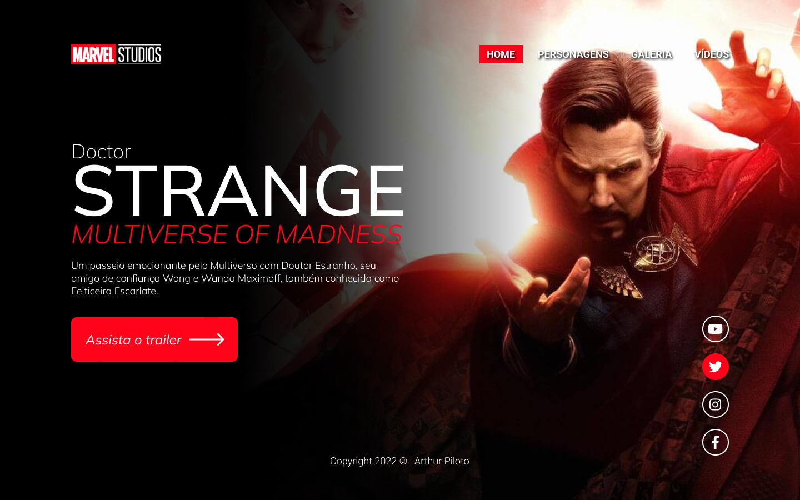
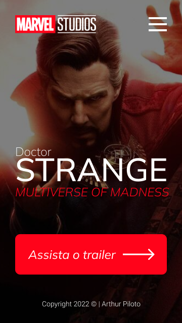
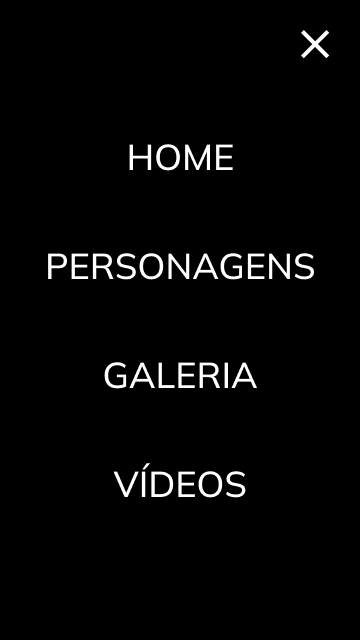

# Doctor Strange

Projeto construído durante as aulas de LIMA, no curso de Desenvolvimento de Sistemas do [SENAI Jandira](https://jandira.sp.senai.br/), com orientação do Prof. [Fernando Leonid](https://github.com/fernandoleonid).

    

    
    

## Qual era o objetivo do projeto?
O objetivo era criar uma landing page com base no design feito no Figma, aprendendo a estrutura do HTML, CSS, JavaScript e conceitos de responsividade.

## O que é uma Landing Page?
Landings Pages são páginas com foco principal na conversão de visitantes, assim, essas páginas possuem uma estética mais minimalista comparada com os sites tradicionais.

## Quais tecnologias foram usadas?
- HTML5
- CSS3
- JavaScript
- Figma

## Links
- [Resultado](https://arthurpiloto.github.io/projeto-strange/)
- [Projeto no Figma](https://www.figma.com/file/xivmBTxAT8z8FMxPuFHVBW/strange-design?node-id=9%3A48)
- [Código](https://github.com/arthurpiloto/projeto-strange)

## Autor
[Arthur Piloto](https://github.com/arthurpiloto)

- [LinkedIn](https://www.linkedin.com/in/arthur-piloto-53ba48237/)
